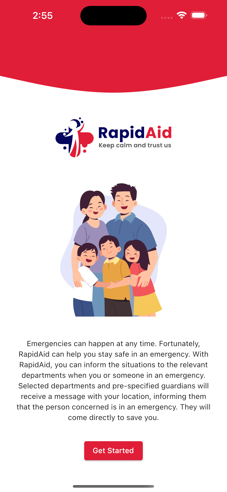
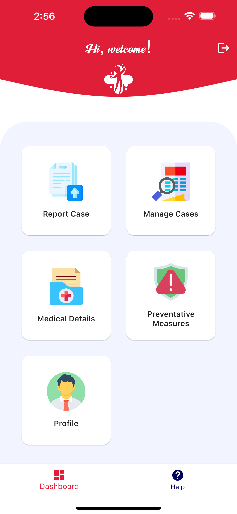
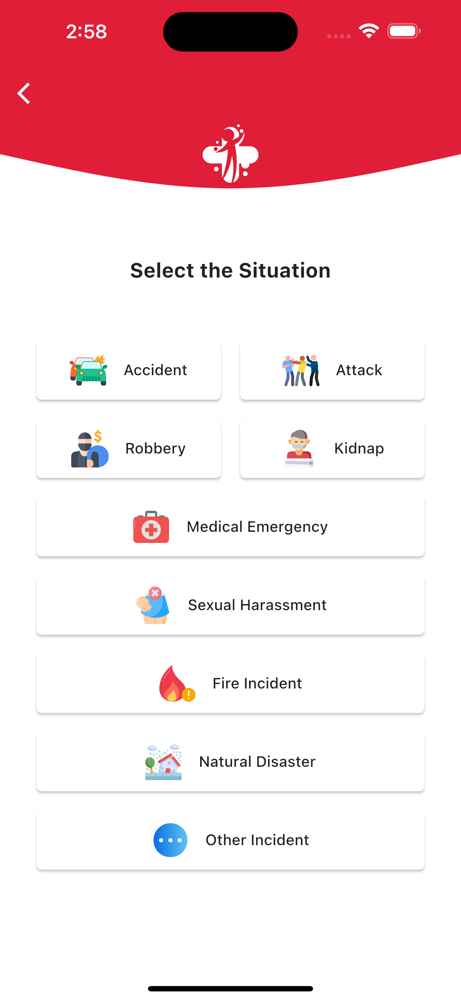
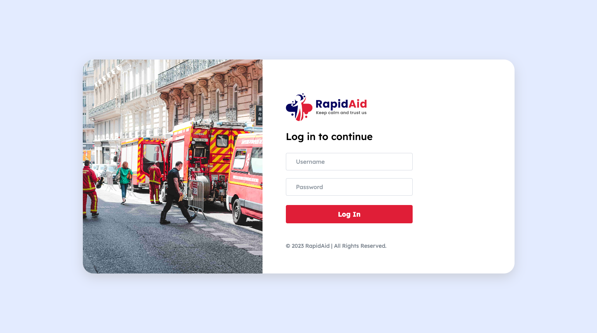
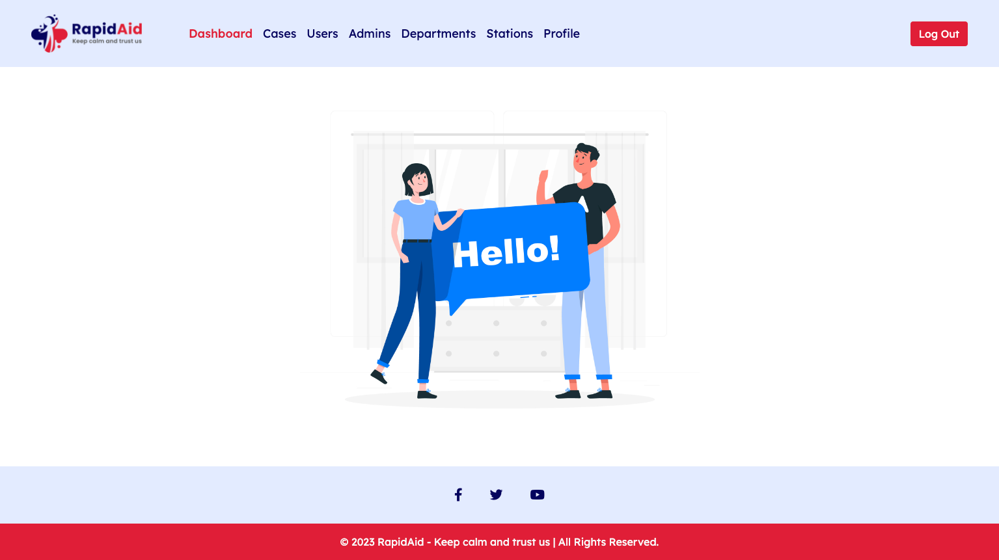
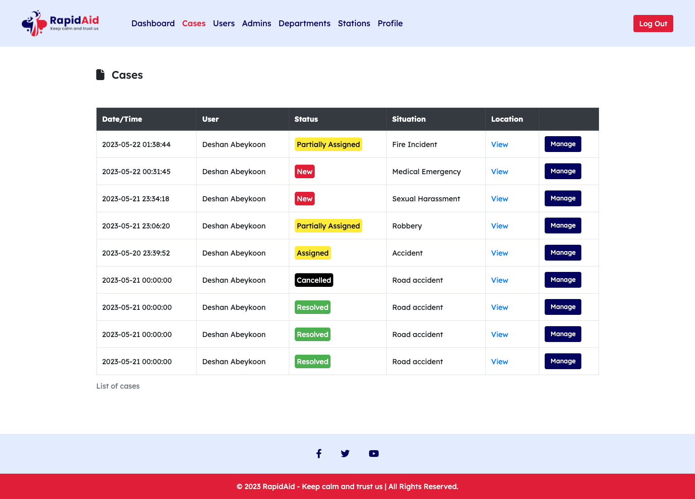
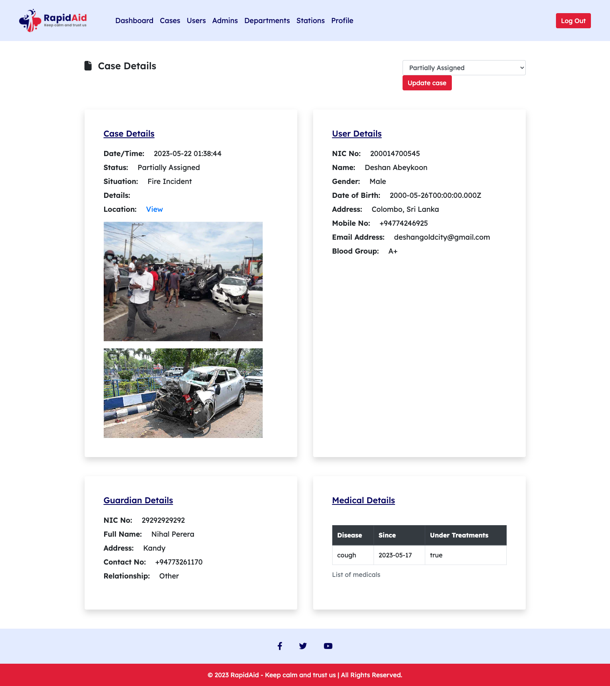
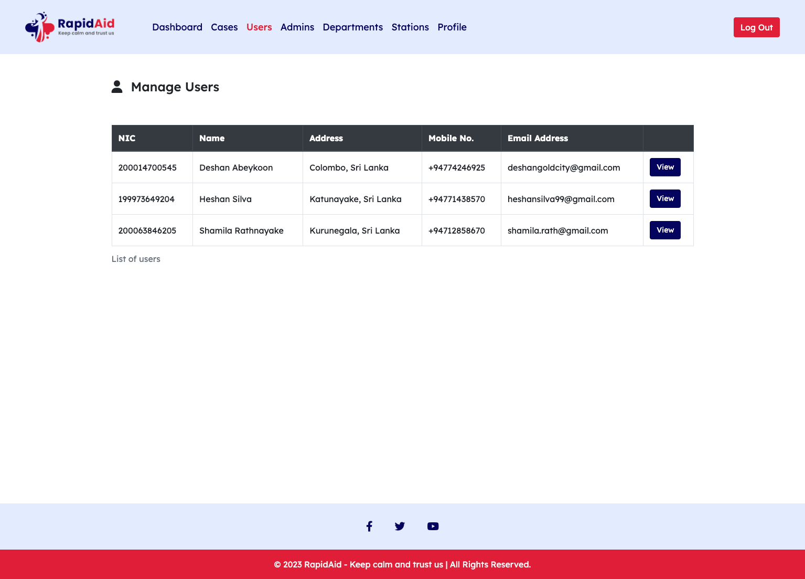
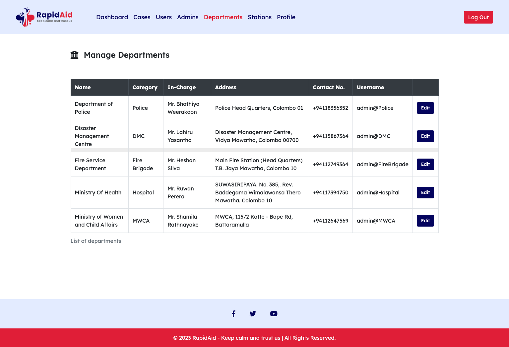

  
  <h1 align="center">RapidAid - Keep calm and trust us</h1>
  
<i>A mobile application and system panel to use in an emergency</i>

 
In today's rapidly changing world, effective emergency management is crucial for mitigating risks, protecting lives, and ensuring the resilience of communities. However, the existing traditional way of handling emergency calls is outdated and not digitally advanced. To address this issue, a cross-platform mobile application with a web-based system panel has been developed.
  
This application allows users to quickly inform relevant departments and guardians about emergencies using their smartphones. The selected departments and guardians receive real-time alerts with the user's location, enabling them to respond promptly and save lives. 
  
The system consists of a mobile application for public users, a web-based system panel for departments, and an admin module for system management. By providing a centralized platform for emergency reporting and response, this system improves the efficiency and quality of emergency services, ensuring that help is readily available to those in need.

<h1 align="center"></h1>

 &nbsp;  &nbsp; 

<h1 align="center"></h1>

 &nbsp; 
  
 &nbsp; 
  
 &nbsp; 

 

## Technologies
  - `Front-End`: Angular, HTML, CSS, JS & TS, Bootstrap, Font Awesome
  - `Back-End`: NodeJs, JS, Express, MongoDB, Mongoose, Nodemon, Dotenv, CORS, JSON, JWT, Morgan, bcryptjs, body-parser, SendGrid, otp-generator, Twilio, http, Flutter Secure Storage, Geo Locator, Image Picker, Flutter Launcher Icons, etc..
  
`Express` used as the middleware to create CRUD endpoints 
`Mongoose` used for managing data in MongoDB using queries 
`Nodemon` used to restart the server whenever saving the files 
`bcryptjs` used to hash the passwords into the protected strings 
`Dotenv` used to manage the `.env` file. 
`CORS` is a express js middleware. Used to enable CORS. etc... 
`SendGrid` has used to send emails and manage email delivery. 
`otp-generator` has used for generating one-time passwords (OTPs) for the authentication purpose. 
`Twilio` API has used for sending SMS. 
`http` used to make HTTP requests and handle responses. 
`Flutter Secure Storage` used to securely store sensitive data such as authentication tokens, passwords on the device. 
`Geo Locator` used to get geolocation capabilities - to retrieve the user's current location. 
`Image Picker` has used to enable the select images facility from the device's gallery. 

 

## Installation and Setup Instructions
1. Clone this repository. You will need `node` and `npm` installed globally on your machine.
2. Open the full-project using VSCode or any other preferred code editor.
3. Navigate to the `client/rapid-aid` directory and run `npm install` to install dependencies.
4. Navigate to the `server` directory and run `npm install` to install dependencies.
5. Run the command `nodemon server` within the `server` directory via terminal.
6. Run the command `ng serve` within the `client/rapid-aid` directory via terminal.
7. Visit App: `http://localhost:4200` or you can try the live website: https://portal.rapidaid.live
